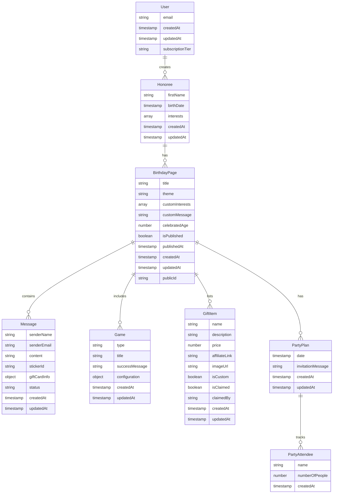

# Birthday Website Builder

A React application for creating personalized birthday webpages for children.

## Firebase Authentication Setup

1. Create a new Firebase project at [Firebase Console](https://console.firebase.google.com/)
2. Enable Email/Password authentication in the Firebase Console
3. Create a `.env` file in the root directory with your Firebase configuration:

```env
VITE_FIREBASE_API_KEY=your_api_key
VITE_FIREBASE_AUTH_DOMAIN=your_auth_domain
VITE_FIREBASE_PROJECT_ID=your_project_id
VITE_FIREBASE_STORAGE_BUCKET=your_storage_bucket
VITE_FIREBASE_MESSAGING_SENDER_ID=your_messaging_sender_id
VITE_FIREBASE_APP_ID=your_app_id
VITE_FIREBASE_MEASUREMENT_ID=your_measurement_id
```

## Installation

1. Install dependencies:

```bash
npm install
```

2. Start the development server:

```bash
npm run dev
```

3. Build for production:

```bash
npm run build
```

4. Preview production build:

```bash
npm run preview
```

## Features

- Passwordless email authentication using magic links
- Secure user session management
- Modern, responsive UI with Material UI (MUI)
- TypeScript for type safety
- ESLint for code quality
- Fast development with Vite

## Project Structure

- `src/` - Main source code directory
  - `components/` - Reusable UI components
  - `config/` - Application configuration files including Firebase setup
  - `contexts/` - React context providers (e.g., AuthContext)
  - `routes/` - Application routes and page components using [React Router v7 file-based routing conventions](https://reactrouter.com/how-to/file-route-conventions)
- `public/` - Static assets
- `vite.config.ts` - Vite configuration
- `tsconfig.json` - TypeScript configuration

## Technology Stack

- **Frontend**: TypeScript React
- **Auth and Backend**: Firebase
- **Generative AI Model**: Gemini
- **UI Framework**: Use one that looks good, is well supported, and is easy to use
- **Linter**: Recommended ESLint React plugin

## Development Style

- Write real, working code in each prompt
- Include understandable comments
- Focus on forward-compatible, MVP-style implementations
- Avoid overengineering, but leave room for scale
- Follow best practices for whatever language you are using
- Make sure the code is formatted consistently

## Value Proposition

- Interactive games and memories for the cost of a birthday card
- Make your honoree feel special with a birthday webpage themed to their interests
- Give your honoree something fun to do with special birthday games
- Let your friends and family join in and share the love
- As a creator, create a special day for your honoree without a ton of effort so you can spend your time with them instead of stressing

## Definitions

- **Creator**: Authenticated user that makes and administers birthday webpages
- **Friends and Family**: Unauthenticated users who can perform some action to contribute to a birthday webpage
- **Honoree**: A specific view mode a creator can enter

## User Stories

### Account Creation and Setup

1. Creators can create an account using their email address using a magic link
2. Creators can eventually upgrade to a paid plan (future feature - ensure architecture supports this)
3. Creators can add profiles for their honorees to their accounts with:
   - Honoree's first name
   - Honoree's birthday
   - Honoree's interests (select from a list of common interests or add free form interests)

### Creating a Basic Birthday Webpage

1. Creators can create a basic birthday webpage by selecting a theme and the honoree the website is for
2. Creators can create multiple birthday webpages for their honoree
3. Creators can modify the interests of the honoree for a specific birthday webpage
4. The following information is automatically filled in to the theme:
   - Honoree's name
   - Honoree's age (based on their birthday)
   - Imagery and colors based on the selected theme (from AI)
5. Creators can add a custom birthday message to the webpage
6. Creators can select from an existing set of themes that honorees commonly like:
   - Theme suggested based on honoree's interests at the honoree level and any customized interests from the birthday page level
   - Search for and suggest a list of themes (e.g., dragons, princesses, dogs, cats, firefighters, construction, cars, kittens, unicorns)
   - Users can use AI to describe what their honoree is interested in and get a theme suggestion back

### Listing Birthday Webpages

1. A list of created birthday webpages should show, including:
   - The birthday age the page was for
   - The name of the honoree it was for
2. Should include links to:
   - Edit the page
   - See the page in honoree mode
   - Visit the public gift guide
   - Visit the page for adding messages

### Birthday Page Feature: Messages from Friends and Family

1. Creators can share a link to friends and family to add messages to the honoree's birthday webpage
2. Friends and family can leave messages that include:
   - Their name (free text)
   - Their email address (for verification by the creator only)
   - A message (free text)
   - A digital sticker they can select from a list of preset sticker images
   - A gift card they can purchase from a variety of providers (with affiliate revenue potential)
3. When someone submits a message, it goes into a pending state that needs to be reviewed by the Creator:
   - **Approved**: The message will show in the messages feed on the birthday page
   - **Rejected**: The message will not show in the messages feed on the birthday page or the pending feed
4. Creators should be able to edit any message at any time

### Birthday Page Feature: Gift Guide

1. After a creator creates a birthday website, they can see a list of suggested gifts based on their honoree's age and interests
2. These products should include a configurable affiliate link that we can set at the app level for common gift sources (e.g., Amazon)
3. Creators can refine their gift suggestions through a chat that uses an AI model
4. Creators can add gifts to a publicly shareable "wish list" they can share with friends and family
5. Creators can add custom entries to the "wish list" in a text field
6. Friends and family can mark that they have "claimed" purchasing a gift (without the need to create an account)

### Birthday Page Feature: Party Plan

1. After a birthday page is created, a creator should be able to use details from the page to plan a birthday party
2. Creators should be able to create a simple digital invitation that includes:
   - The date of the party
   - Their honoree's name
   - Their honoree's age the birthday is being celebrated
   - A custom message from the Creator
3. Friends and family should be able to mark that they are planning to attend through a simple form:
   - Name (free text)
   - Number of people coming (number)
4. Creators should see a list of suggested party supplies based on the theme of the birthday webpage:
   - Possible supplies include:
     - Party hats
     - Paper plates and flatware
     - Streamers
     - Banners
   - These products should use the configurable affiliate link that was set up for the gift guide

### Birthday Page Feature: Adding Games to Birthday Webpage

1. Creators can select the games they want to appear for their honorees and customize them
2. Each game will have their own set of requirements, but common attributes include:
   - Success message - customizable message that appears when a game has been completed

#### Birthday Game: Quiz

1. A simple multiple choice quiz that includes 10 questions
2. By default, the questions and answers are created by AI using the honoree's interests and age
3. Each question should have 3 possible answers
4. A creator can modify any question or answer
5. A creator can add or remove any question
6. **Honoree view**:
   - When viewing the game as an honoree, the honoree should have the ability to click a button to remove one of the incorrect answers

#### Birthday Game: Fill-in-the-Blanks

1. A simple mad-libs style game
2. By default, a short, 3-4 sentence story is created about the honoree based on their age, interests, and theme
3. Creators can edit the story, including adding new fill-in-the-blank words
4. Fill-in-the-blank words should appear like "[TYPE_OF_WORD]"
5. **Honoree view**:
   - The first screen should show a list of the fill-in-the-blank words
   - After filling in all the fields and submitting, the second screen should show the completed story

### Viewing the Page as an Honoree

1. Creators should be able to publish their birthday page so their honoree can see it
2. Publishing a birthday page should cost a one-time configurable fee (to start, $1.99) per page
3. A Creator must be logged in to view a page in honoree mode
4. **Basic page** - The following information should be shown in read-only mode:
   - The honoree's name and age in a happy birthday headline
   - The Creator's custom message for the page
   - The page should be themed (images, colors, fonts) based on the selected theme
   - Feed of approved messages from friends and family:
     - Each message should display as an envelope with the sticker the friend/family selected
     - When the honoree selects a message, it should display the message information, who it was from, and gift card link if applicable
   - Feed of games:
     - When an honoree selects a game, they should go through the process for that game

## Data Model

### Entities and Relationships

#### User

Represents an authenticated creator who manages birthday webpages.

- `email`: String
- `createdAt`: Timestamp
- `updatedAt`: Timestamp
- `subscriptionTier`: String (for future paid plans)

#### Honoree

Represents a person for whom birthday webpages are created.

- `firstName`: String
- `birthDate`: Timestamp
- `interests`: Array<String>
- `createdAt`: Timestamp
- `updatedAt`: Timestamp

#### BirthdayPage

Represents a specific birthday webpage created for an honoree.

- `title`: String
- `theme`: String
- `customInterests`: Array<String> (overrides honoree interests for this page)
- `customMessage`: String
- `celebratedAge`: Number
- `isPublished`: Boolean
- `publishedAt`: Timestamp
- `createdAt`: Timestamp
- `updatedAt`: Timestamp
- `publicId`: String (for sharing with friends and family)

#### Message

Represents messages from friends and family.

- `senderName`: String
- `senderEmail`: String
- `content`: String
- `stickerId`: String
- `giftCardInfo`: Object (optional)
- `status`: String (pending, approved, rejected)
- `createdAt`: Timestamp
- `updatedAt`: Timestamp

#### Game

Represents a game added to a birthday page.

- `type`: String (quiz, fill-in-the-blanks, etc.)
- `title`: String
- `successMessage`: String
- `configuration`: Object (game-specific configuration)
- `createdAt`: Timestamp
- `updatedAt`: Timestamp

#### GiftItem

Represents an item in a gift guide.

- `name`: String
- `description`: String
- `price`: Number
- `affiliateLink`: String
- `imageUrl`: String
- `isCustom`: Boolean
- `isClaimed`: Boolean
- `claimedBy`: String (optional)
- `createdAt`: Timestamp
- `updatedAt`: Timestamp

#### PartyPlan

Represents a party plan for a birthday page.

- `date`: Timestamp
- `invitationMessage`: String
- `createdAt`: Timestamp
- `updatedAt`: Timestamp

#### PartyAttendee

Represents someone who plans to attend a party.

- `name`: String
- `numberOfPeople`: Number
- `createdAt`: Timestamp

### Data Model Diagram



### Firestore Implementation Best Practices

1. **Collection Structure**:

   - `/users/{userId}`
   - `/users/{userId}/honorees/{honoreeId}`
   - `/users/{userId}/honorees/{honoreeId}/birthdayPages/{pageId}`
   - `/users/{userId}/honorees/{honoreeId}/birthdayPages/{pageId}/messages/{messageId}`
   - `/users/{userId}/honorees/{honoreeId}/birthdayPages/{pageId}/games/{gameId}`
   - `/users/{userId}/honorees/{honoreeId}/birthdayPages/{pageId}/giftItems/{itemId}`
   - `/users/{userId}/honorees/{honoreeId}/birthdayPages/{pageId}/partyPlan`
   - `/users/{userId}/honorees/{honoreeId}/birthdayPages/{pageId}/partyPlan/attendees/{attendeeId}`
   - `/publicPages/{publicId}` (for public access to published pages)

2. **Denormalization for Efficient Reads**:

   - Store frequently accessed data together to minimize reads
   - For example, include basic honoree info (name, age) directly in the BirthdayPage document
   - Cache theme data in the BirthdayPage document to avoid additional lookups
   - Create a duplicate public document for published pages with necessary data for public access

3. **Indexing Strategy**:

   - Create composite indexes for common queries:
     - birthdayPages: [updatedAt] - For listing pages by creation date
     - messages: [status] - For filtering pending/approved messages
     - giftItems: [isClaimed] - For filtering claimed/unclaimed gifts

4. **Security Rules**:

   - Enforce that creators can only read/write their own data
   - Allow public read access to published birthday pages via the publicPages collection
   - Restrict message approval to creators only
   - Allow anonymous writes to messages and party attendees collections

5. **Batch Operations**:

   - Use batch writes for related operations (e.g., creating a birthday page and its initial games)
   - Use transactions for operations that need atomicity (e.g., claiming a gift)

6. **Cost Optimization**:

   - Use the nested collection structure to naturally scope queries and reduce read costs
   - Implement caching strategies for frequently accessed data
   - Use Firestore data bundles for static content
   - Create duplicate public documents only when pages are published

7. **Public Access Strategy**:
   - When a page is published, create a duplicate document in a flat `/publicPages/{publicId}` collection
   - This document contains only the data needed for public access
   - This approach allows for efficient public access without exposing the nested structure
   - Update the public document whenever the original page is updated

## Future Features

These are potential features that we want the system to be flexible enough to handle but are not implementing yet:

1. Make certain games or messages only unlock after a certain date and time to spread out the fun throughout a birthday day
2. Add some sort of larger game that requires the honoree to complete each of the games on the page to get enough clues to solve the larger game
3. Add additional games like:
   - A crossword maker that takes the honoree's age and interests into accounts while creating clues and answers
   - Rebus puzzles
4. Add the ability for honorees to "phone a friend" and send a message to a loved one for help with games as a way to connect
5. Add a button for the completed Fill-in-the-blank story to be read using an AI voice that sounds like a narrator
